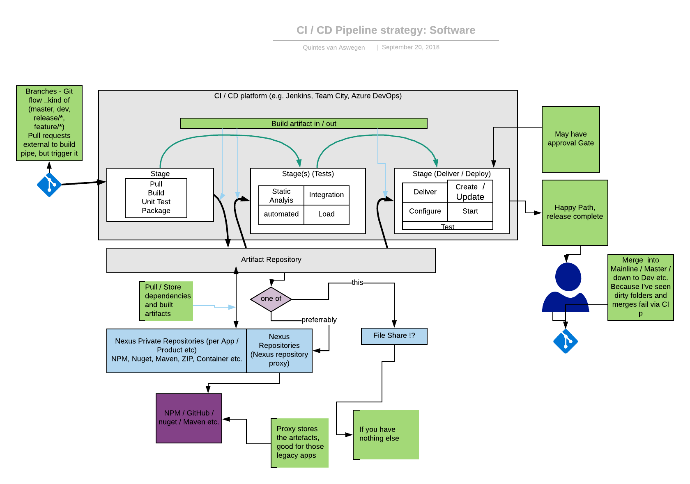

# strategies-cicd
Strategies based on experience 

CI / CD Strategy: Software focus

# Tools

- Build / Deploy platform:  Jenkins, Team City
- Deploy platform: Jenkins, Team City, Octopus
- Targets: Linux, Windows, On-Prem, PaaS, IaaS, Container
- Artefact management: Nexus for build artefacts and as proxy to dependencies
- SCM: Git, git branches MASTER, DEVELOPMENT, RELEASE/*, FEATURE/*, pull requests and merging external to CICD operations
- Test: unit test frameworks, selenium, browserstack, phantom, 
- Static Analysis - SonarQube
- Security - TBC, manual delivery to HP FoD ..
- Load Test: JMeter, Blazemeter
- Deploy: cloud specific, cli / scripts, ssh/bash, platform tooling 

# License:
Refer LICENSE and LICENSE-CODE in repository at https://github.com/quintesNZ/strategies-cicd

Copyright (C) 2018 Quintes van Aswegen 
